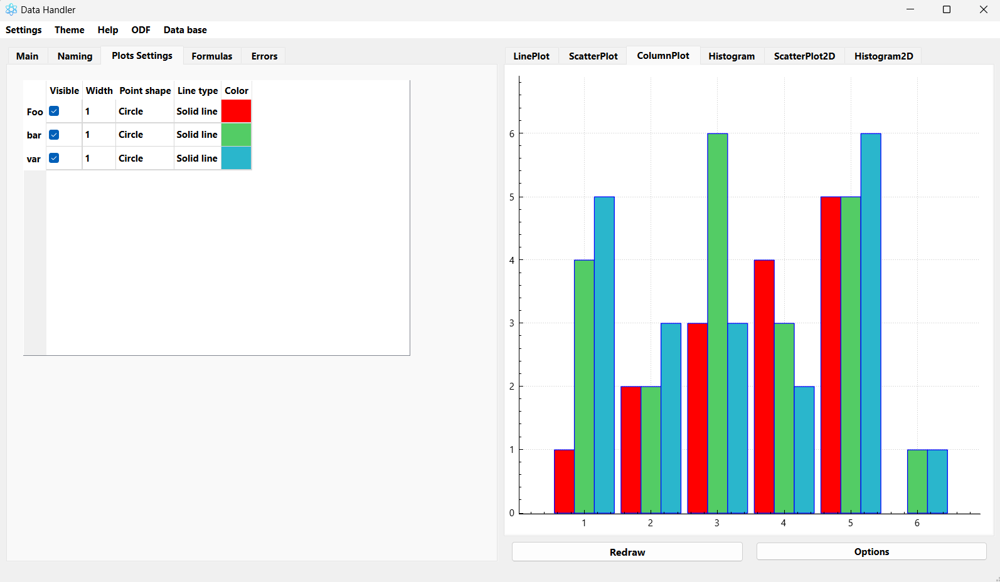

# Experimental Data Processor
## Worked on the project:
* Георгий Суханов
* Курченко Матвей
* Юрий Шишкинский
# Description
The project is implemented in C++ using the Qt6 framework and its QCustomPlot widget. 
CMake is used to build the project.  
Experimental data and measurement errors can be entered into the program either manually or automatically from a csv file.
The data is stored in a database. Using this data, the program builds a line plot, a scatter plot, a column plot, a histogram,
a 2D scatter plot and a 2D histogram. If desired, the appearance of the graphs can be changed using a special table and
the options button. You can also write calculation formulas for generating a report. Reports are generated in an ODF file.

